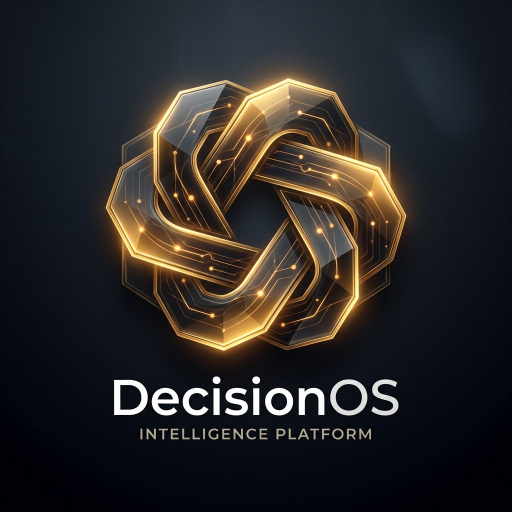
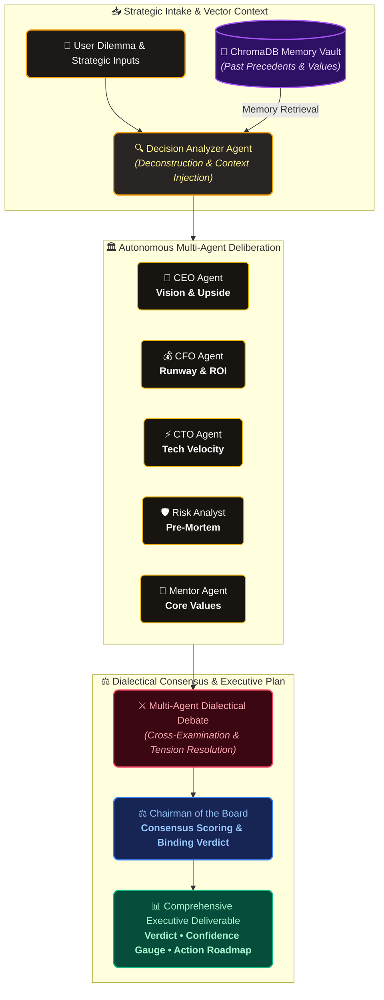

<div align="center">
  
  
  # DecisionOS: AI-Powered Personal Board of Directors
  
  <p><b>Autonomous Executive Strategic Intelligence Platform powered by Multi-Agent Consensus & Long-Term Vector Memory</b></p>

  [](https://decisionos-ai-boardroom.vercel.app)
  [](https://decisionos-ai-boardroom.vercel.app/DecisionOS.apk)
  [](https://decisionos-ai-boardroom.vercel.app)
  [](https://fastapi.tiangolo.com)
  [](https://github.com/langchain-ai/langgraph)
  [](https://www.trychroma.com/)
  [](https://reactjs.org/)
  [](https://opensource.org/licenses/MIT)

  <br />

  [🌐 **Live Web Application**](https://decisionos-ai-boardroom.vercel.app) • [📲 **Download Android APK**](https://decisionos-ai-boardroom.vercel.app/DecisionOS.apk) • [📖 **API Documentation**](https://decisionos-ai-boardroom.onrender.com/docs)
</div>

<br />

---

## 🌟 1. What is DecisionOS?

**DecisionOS** is an executive-grade strategic intelligence platform that empowers founders, engineering leaders, and ambitious professionals to navigate high-stakes career, business, and architectural dilemmas.

Instead of consulting a single chatbot that gives a generic answer, **DecisionOS simulates a personalized, autonomous Board of Directors** consisting of 6 specialized executive personas (CEO, CFO, CTO, Risk Analyst, Mentor, and Chairman). The advisors debate each other in real-time, cross-examine assumptions, recall historical precedents from long-term vector memory, and produce a unified, synthesized strategic verdict.

---

## 💡 2. Is DecisionOS Useful? Will People Actually Use It?

The short answer is **yes, absolutely** — because it solves a painful, high-stakes problem that generic single-prompt AI tools fail at:

### 🧠 The Problem: The "Echo Chamber" of Solo Decision-Making

When people face high-stakes dilemmas (career shifts, fundraising, tech rewrites, hiring, personal investments), they usually suffer from three problems:

* **Isolation & Decision Fatigue:** Founders, solo engineers, and executives have no one to test their raw ideas against without fear of judgment or bias.
* **ChatGPT is a "Yes-Man" (Sycophancy):** If you ask a single chatbot *"Should I quit my job and build this startup?"*, it almost always replies with enthusiastic encouragement. It does not vigorously stress-test your downside or demand a financial runway calculation.
* **Human Advice is Biased:** Friends give emotional comfort; investors give self-interested advice; mentors have limited time.

### ⚔️ Generic AI Chatbots vs. DecisionOS


| Dimension | Generic AI Chatbots | **DecisionOS (AI Boardroom)** |
| :--- | :--- | :--- |
| **Perspective** | Single agreeable "yes-man" response. | **6 Adversarial Executive Personas** actively challenging each other. |
| **Memory** | Session-scoped; forgets context in new chats. | **ChromaDB Vector Vault:** Recalls user values, past choices & outcomes over months. |
| **Adversarial Testing** | Surface-level pros and cons. | **Round-Table Cross-Examination:** CFO challenges ROI, Risk installs 90-day tripwires. |
| **Deliverable** | Unstructured wall of chat text. | **Executive Deliverable:** Confidence score (0–100%), Tension Matrix, and Tactical Roadmap. |
| **Experience & Modality**| Text-only typing. | **Spoken Voice Narration (TTS), Voice Dictation (STT), and Standalone Mobile App.** |

---

## 🎯 3. Who is DecisionOS Built For?

* **🚀 Solo Founders & Indie Hackers:** Acts as a 24/7 personal advisory board before spending capital, hiring, or pivoting product strategy.
* **🛠️ Tech Leads & Senior Engineers:** Stress-tests architectural trade-offs (*Microservices vs Monolith*, *Build vs Buy*, *Refactoring vs Shipping*).
* **📈 High-Stakes Career Navigators:** Evaluates salary vs equity packages, leadership promotions, and international relocations.
* **🎓 Graduates & Ambitious Professionals:** Unpacks pivotal life crossroads with grounded, multi-dimensional counsel.

---

## ⚙️ 4. How It Works (Multi-Agent Deliberation Architecture)

When you submit a strategic dilemma, DecisionOS orchestrates a multi-stage cognitive workflow:




---

## 👥 5. The Autonomous Board Members

| Advisor | Role & Mandate | Strategic Lens |
| :--- | :--- | :--- |
| **CEO Agent** | *Chief Executive Officer* | Long-term compounding growth, market leverage, asymmetric upside, brand equity. |
| **CFO Agent** | *Chief Financial Officer* | Financial runway modeling, risk-adjusted ROI, liquid cash preservation, equity discounting. |
| **CTO Agent** | *Chief Technology Officer* | Skill velocity, technical mastery, architecture ownership, avoiding technical debt & obsolescence. |
| **Risk Analyst** | *Chief Risk Officer* | Pre-mortem auditing, worst-case scenario analysis, 90-day tripwires, downside hedging. |
| **Mentor Agent** | *Life Strategy Guardian* | Alignment with authentic personal values, work-life balance, retrospective memory retrieval. |
| **Chairman Agent** | *Board Moderator & Arbiter* | Synthesizes opposing viewpoints, calculates consensus score, delivers binding verdict. |

---

## 🚀 6. Core Features & Capabilities

1. **Multi-Agent Dialectical Debate (LangGraph)**
   - Autonomous cross-examination where advisors challenge each other's assumptions in round-table deliberation.
2. **Semantic Memory Vault (ChromaDB)**
   - Embeds past user decisions, chosen alternatives, and retrospective outcomes. Automatically retrieves historical learnings during new deliberations.
3. **Comprehensive Executive Deliverables**
   - Official Recommendation & Final Verdict
   - Confidence Score Gauge (0–100%)
   - Unanimous Agreements vs. Debated Tensions Matrix
   - Pre-Mortem Risk Audit & Tactical Safeguards
   - Step-by-Step Action Roadmap
4. **Explainability & Interactive Board Debrief ("Ask the Board")**
   - Directly interrogate individual board members (e.g. *"CFO, why did you advise against Option B?"*) or the entire board with grounded responses.
5. **Synchronized Voice Narration (TTS) & On-Demand Speech**
   - Real-time spoken debate narration where advisor turn progressions wait synchronously for speech synthesis before advancing.
   - Interactive on-demand speaker playback while paused.
6. **Hands-Free Speech-to-Text Dictation**
   - Pre-flight microphone permission handshake for high-accuracy voice dictation when submitting dilemmas or chatting with copilot.
7. **Progressive Web App (PWA) & Direct Android APK**
   - 100% store-ready PWA with offline caching (`/sw.js`), Apple touch home-screen engine, and direct `.apk` binary distribution.
8. **Global Multi-Language Support (12+ Languages)**
   - Dynamic localization (English, Hindi, Spanish, French, German, Japanese, Chinese, Arabic, Russian, Portuguese, etc.) with localized voice audio synthesis.
9. **Interactive Avatar Studio**
   - Zero-lag 120 FPS draggable & expandable circular lens cropper with client-side canvas processing.
10. **Executive Glassmorphism Cockpit UI**
    - Dynamic radial boardroom visualizer, consensus metrics, and command palette (`Ctrl + K`).

---

## 🛠️ 7. Tech Stack

- **Backend**: Python 3.11+, FastAPI, SQLAlchemy (Async), SQLite / PostgreSQL, Pydantic v2.
- **Orchestration**: LangGraph, LangChain Core.
- **Vector Database**: ChromaDB.
- **Security**: JWT Authentication (python-jose, bcrypt).
- **Frontend**: React 18, Vite, Lucide React, Custom Dark Glassmorphism CSS Design System.
- **LLM Support**: Ollama (Llama 3, Mistral), OpenAI API, and High-Fidelity Simulation Engine.
- **Mobile Distribution**: Progressive Web App (PWA), Trusted Web Activity (TWA), Direct Android APK.

---

## ⚡ 8. Quick Start & Setup

### 1. Clone & Setup Backend

```bash
cd backend
python -m venv .venv
source .venv/bin/activate  # On Windows: .venv\Scripts\activate
pip install -r requirements.txt
uvicorn app.main:app --reload --port 8000
```
FastAPI documentation will be available at [http://localhost:8000/docs](http://localhost:8000/docs).

### 2. Setup Frontend

```bash
cd frontend
npm install
npm run dev
```
Open [http://localhost:5173](http://localhost:5173) in your browser.

---

## 🧪 Running Automated Tests

```bash
cd backend
pytest tests -v
```

---

## 🐳 Docker Deployment

```bash
docker-compose up --build
```
- Frontend: `http://localhost:3000`
- Backend API: `http://localhost:8000`

---

## ☁️ Cloud Deployment (Render + Vercel)

- **Frontend (Vercel):** Connected to `main` branch with automatic edge deployments.
- **Backend (Render):** Deployable via the included `render.yaml` Blueprint with managed PostgreSQL and ChromaDB persistent storage.

---

## 📝 License

Distributed under the MIT License. See `LICENSE` for more information.
